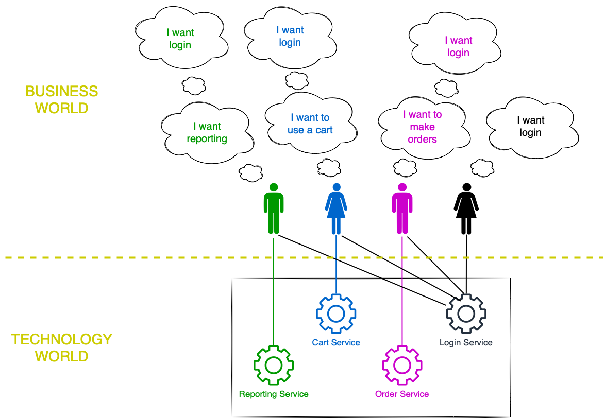
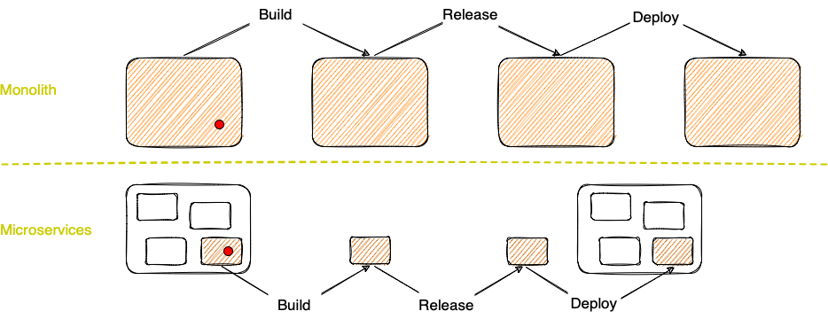
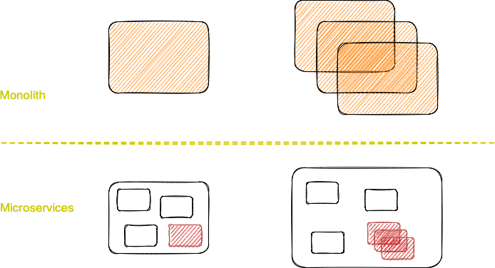
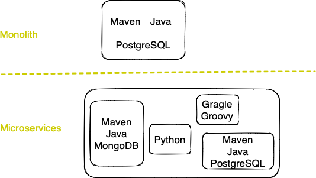

## Тодор Олев
## https://www.linkedin.com/in/todor-olev-81519825/
## todor.olev@gmail.com
 
 

# Building microservices with Java (SoftUni Workshop)
## "Бързо” определение за микросървис

 

 

Микросървисна архитектура е подход за разработка на интегрирано софтуерно решение като група от ***малки*** услуги, всяка от които работи в свой ***собствен отделен процес*** и които комуникират с технологично независими и лесни за управление механизми - често чрез споделяне на ресурси по HTTP или обменяне на съобщения (MQ). Всяка от тези услуги е разработена, за да обезпечи определена бизнес ***функционалност***. Услугите са ***самостоятелни компоненти***, могат да бъдат реализирани с използването на различни технологии и се деплойват независимо, обикновено чрез автоматизиран механизъм. 

 

## Защо микросървисите са предпочитана архитектура за много софтуерни решения

 

### 1. Управление на промените

|Монолит|Микросървиси|
|-------|------------|
|Промяна в малка част от софтуера изисква билд, релийз и деплой на целия монолит.| Промяната в даден микросървис изисква билд, релийз и деплой само на един микросървис.|
|Скалирането на дадена функционалност изисква скалиране на целия монолит.| Скалирането на дадена функционалнос изисква скалиране само на микросървисът, който изпълнява тази функционалност.|

 

### 2. Управление на технологиите

|Монолит|Микросървиси|
|-------|------------|
|Много трудно или невъзможно е да се използват различни технологии, напр. различни езици за програмиране.| Всеки микросървис може да бъде реализиран с различни технологии от останалите микросървиси в системата.|

 

### 3. Управление на архитектурата и структурата

|Монолит|Микросървиси|
|-------|------------|
|Tрудно e да се постигне добра ***модулна структура***, при която модулите са сравнително независими, комуникират чрез абстрактни API и отговарят за отделни бизнес функционалности. |Микросървисите сами по себеси са отделни модули на софтуерното решение.|

 

### 4. Микросървисните архитектури са използвани в много проекти през последните няколко години и резултатите са положителни.

 

## Да създадем няколко микросървиса, които комуникират помежду си

### Demo
https://start.spring.io