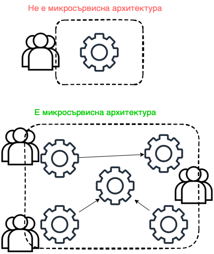
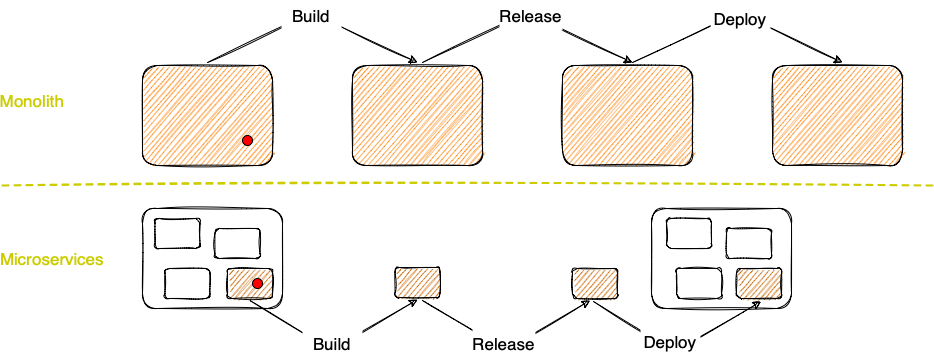
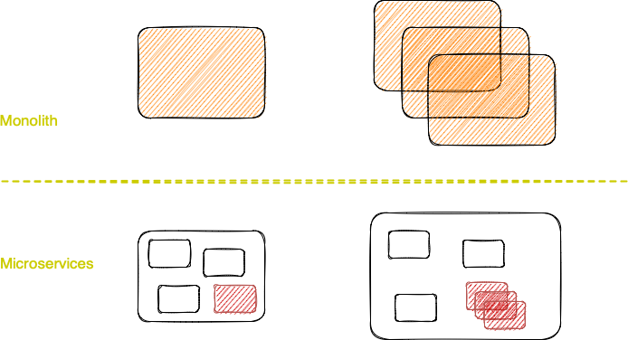
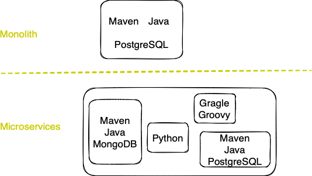

## Тодор Олев
## https://www.linkedin.com/in/todor-olev-81519825/
## todor.olev@gmail.com
 
 

# Building microservices with Java (SoftUni Workshop)
## "Бързо” определение за микросървис

Колкото и да е "бързо", ще ни отнеме няколко минути, защото: 
 - Няма конкретно или стандартно определение за това какво е микросървис.
 - Съществуват общи характеристики, които са валидни за повечето микросървисни архитектури.

Когато говорим за микросървиси (microservices) всъщност имаме предвид микросървисна архитектура (microservices architecture). Обикновено в такава архитектура участват множество микросървиси, които комуникират помежду си. Ако едно цялостно софтуерно решение представлява един сървис, който е малък като обем код и се разработва от малък екип, то това не е точно микросървис. Значимите характеристики на микросървисните архитектури се отнсят именно до организирането, комуникацията, скалирането, деплойването на множество отделни самостоятелни компоненти, които допринасят за успешното използване на дадено софтуерно решение.

### Определение
Нека все пак формулираме едно кратко обобщение на общите характеристики на микросървисите, без да претендираме за изчерпателност. 

Микросървисна архитектура е подход за разработка на интегрирано софтуерно решение като група от малки[^1] услуги, всяка от които работи в свой собствен отделен процес и които комуникират с технологично независими и лесни за управление механизми - често чрез споделяне на ресурси по HTTP или обменяне на съобщения (MQ). Всяка от тези услуги е разработена, за да обезпечи определена бизнес функционалност[^2]. Услугите са самостоятелни компоненти[^3], могат да бъдат реализирани с използването на различни технологии и се деплойват независимо, обикновено чрез автоматизиран механизъм. 

[^1]:малки - Колко код е достатъчно малко и колко е твърде много? Трудно е да се каже. Имплементацията на всяка услуга е фокусирана в конкретна бизнес функционалност и се реализира от един екип. Екипът е отговорен за целия живот на микросървиса - от анализа на бизнес изискванията, през разработката на кода и тестването, до реагирането на реален проблем при клиента в 2 ч. през нощта. Ако екипът е прекалено малък, то той може често да се проваля в реализирането изискванията на бизнеса; ако е прекалено голям - може да няма достатъчно работа за всеки. Оптималната големина варира от 5-6 до около 12 човека.

[^2]:Характерно за микросървисните архитектури е всеки микросървис да се разработва в пълнота относно тази бизнес логика, за която той е създаден. Това означава, че екипът, който разработва един микросървис за дадена бизнес функционалност, често също така създава и поддържа потребителският интерфейс за същата функционалност, както и базата от данни. При софтуерните решения, изградени от микросървиси, е характерно базата от данни да е децентрализирана.

[^3]:самостоятелен компонент - Част от интегрирано софтуерно решение, което може да се премахва, заменя и деплойва независимо от останалите части на софтуерното решение; т.е. компонент не може да бъде клас или библиотека, докато един миркосървис идеално пасва на даденото определение. Ако един компонент бъде премахнат или спре да работи, то тогава цялата система трябва да продължи да работи, макар и с ограничени възможности.

---
### Допълнение
Разработването на софтуер според микросървисна архитектура изисква промяна в цялостното мислене и нагласа на екипите. Разработката на микросървиси, които комуникират помежду си мотивират комуникация и между отделните екипи. Седователно тези екипи, в които външната комуникация не е проблем, вероятно ще са по-успешни. От друга страна екипите, които са развили добра вътрешна колаборация, също имат предимство. Екипът носи отговорност за постигането на интегритет и съвместимост на различни нива при изграждането на един микросървис -  потребителски интерфейс, бекенд, база от данни. Колкото по-добра е вътрешната комуникация в екипа, толкова по-лесно се постига добра комуникация между тези отделни нива.

При софтуерните решения, разработвани според микросървисни архитектури, е нормално един екип да разработва няколко различни микросървиса.

## Защо микросървисите са предпочитана архитектура за много софтуерни решения

Решението да се използва микросървисна архитектура рядко се взима в началото на проекта. В повечето случаи то е продиктувано от трудности при разработването на съществуващо софтуерно решение в монолитен стил[^4], когато микросървисите могат да помогнат при тези трудности. Всъщност в много случаи е добре да не мислим за микросървисна архитектура докато не установим конкретни ползи, които бихме имали от нея, тъй като микросървисите невинаги са подходящо решение.

[^4]:монолитен стил - В общия случай това е софтуерно решение, изградено от един единствен компонент. Понякога като монолити обозначаваме и системи, изградени от няколко компонента; когато тези компоненти са прекалено зависими един от друг или когато не са разработени за определена бизнес функционалност. Понятието "микросървисна архитектура" се разграничава от понятието "SOA". Една от причините е, че SOA е натоварено с прекалено много значения и интерпретации - до толкова, че програмистите често понякога откриват SOA дори и там, където тя на практика липсва. По-важната причина за разграничаването е, че при много софтуерни решения SOA се фокусира в интегрирането на монолитни компоненти чрез ESB. Това също изглежда като многокомпонентна архитектура, но определено не е микросървисна архитектура, тъй като всеки компонент е отговорен за множество различни бизнес функционалности.

Някои трудности, които срещаме при използване на монолитен стил и които могат да бъдат разрешени с използването на микросървисна архитектура:

### 1. Управление на промените

|Монолит|Микросървиси|
|-------|------------|
|Промяна в малка част от софтуера изисква билд, релийз и деплой на целия монолит.| При микросървисна архитектура промяната в даден микросървис изисква билд, релийз и деплой само на един микросървис. Понякога промяната в един микоросървис налага промени и в други микросървиси, напр. когато променяме контракът[^5] на API-то на микросървиса. Все пак, промяната отново е локализирана, спрямо монолитния стил. Има начини за упраавление на промените в контракта, чрез които дори тези случаи рядко налагат промяна в други микросървиси.|
|Скалирането[^6] на дадена функционалност изисква скалиране на целия монолит.| Скалирането на дадена функционалнос изисква скалиране само на микросървисът, който изпълнява тази функционалност.|

### 2. Управление на технологиите

|Монолит|Микросървиси|
|-------|------------|
|При монолитен стил е много трудно или невъзможно да се използват различни технологии, напр. различни езици за програмиране.| Всеки микросървис може да бъде реализиран с различни технологии от останалите микросървиси в системата. Тази възможност позволява използването на най-добрия инструмент за целта. Също така, често решението за използваните технологии е продиктувано от опита на хората в екипа - ако повечето хора имат богат опит с разработване на Java, то вероятността да се използва Java е много голяма, защото точно с този език за програмиране екипът може да започне работа бързо и ефективно.

### 3. Управление на архитектурата и структурата

|Монолит|Микросървиси|
|-------|------------|
|При големите монолитни софтуерни решения е трудно да се постигне добра модулна[^7] структура, при която модулите са сравнително независими, комуникират чрез абстрактни API и отговарят за отделни бизнес функционалности. Реално няма пречка това да бъде постигнато и дори се насърчава, но много често с времето границите на модулите се преплитат, допуска се директна комуникация (т.е. свързване на отделни модули), както и използването на един модул за няколко бизнес функционалности.|Микросървисите сами по себеси са отделни модули на софтуерното решение.|

### 4. Микросървисните архитектури са използвани в много проекти през последните няколко години и резултатите са положителни.

[^5]: контракт - Съвкупност от идентификаторите на API и техните съответни параметри на заявка и отговор.

[^6]: скалиране - Увеличаване на възможностите на софтуерен компонент, обикновено породено от завишени изисквания на консуматора на този компонент.

[^7]: модул - Част от интегрирано софтуерно решение, което е логически, архитектурно и структурно отделено от останалите части. Напр. в Java - съвкупност от класове и пакети с общо предназначение. Това определение прилича на определението за компонент, но не включва изискването за самостоятелно премахване, заменяне и деплойване.

---
### Допълнение
Списъкът, представен тук, не е изчерпателен, а съдържа само няколко примера. Ако посочените примери представляват трудности или проблеми при разработването на дадено софтуерно решение, то със сигутрност е добре да се помисли за микросървисна архитектура. Но също така може да има и други причини, някои от които дори чисто субективни, за да започнем да мислим за микросървиси. От друга страна, не трябва да се забравя, че микросървисите не са лек за всяка болка и има много случаи, в които те не са подходящо решение. Както всеки архитектурен стил и те притежават своите недостатъци. Например, казахме, че микросървисите комуникират с технологично независими и сравнително лесни за управление механизми - често чрез споделяне на ресурси по HTTP или обменяне на съобщения. Тези механизми предполагат по-добра модулна структура и относителна независимост, но освен това са бавни и ненадеждни в сравнение с комуникацията вътре в самия процес (има се предвид процес на операционната система).

## Да създадем няколко микросървиса, които комуникират помежду си

### Spring

https://start.spring.io

### Maven & Gradle

### Embedded AS (Tomcat)

### cart-service & order-service
    cart-service
        Controller
            Annotation
        Model

    ordeer-service
        Controller
            RestTemplate